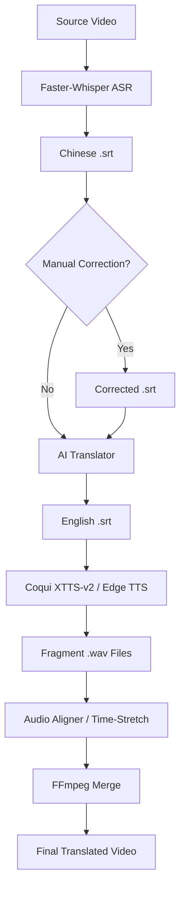

# Instructional Video Auto-Translation System 🎥→🌍

[Traditional Chinese Version (繁體中文版)](README.md)

This is a fully automated video translation system specifically designed for physiology instructional videos, capable of converting Chinese teaching videos into high-quality English versions.

> [!CAUTION]
> **Medical Disclaimer**: The translated content and terminology generated by this system are intended for academic exchange and educational reference ONLY. AI translations may contain errors. For clinical medical use or formal educational diagnosis, please ensure a final review by licensed medical professionals. The developers are not responsible for any consequences resulting from translation errors.

## 🌟 Core Features

1.  **Automatic Speech Recognition (ASR)** - Uses Faster-Whisper to extract Chinese subtitles.
2.  **Intelligent Translation** - Defaults to Google Translate (Free) with **Physiology & Medical Terminology Optimization**.
3.  **Video Generation & Cloning** - Supports Edge TTS (Default) and **Coqui XTTS-v2** Voice Cloning (preserves the original speaker's characteristic).
4.  **Precise Alignment & Synthesis** - Uses `align_audio.py` for automated duration calculation and `FFmpeg` lossless time-stretching, solving audio-video desync issues.
5.  **GPU Acceleration & Version Locking** - Deep integration with **NVIDIA RTX 4090 (CUDA 12.1)** for 5x speed increase; manual locking of `transformers` and `torch` versions for extreme stability.
6.  **Modular Script Pipeline** - Individual scripts can be called for translation, reference audio extraction, TTS generation, audio alignment, etc.

## 🎓 Tailored for Physiology & Medicine

-   **100+ Professional Glossary**: Covers Nervous, Endocrine, Respiratory, Circulatory, Digestive, and Reproductive systems.
-   **Smart Terminology Check**: Automatically ensures medical terms are translated accurately.
-   **Academic Tone Adjustment**: Suitable for university-level medical education.
-   Check [MEDICAL_TERMS_EN.md](MEDICAL_TERMS_EN.md) for the full terminology list.
- **System Architecture**:


## 💰 Cost Description

-   **Completely Free**: Using default configuration (Google Translate + Medical Terminology Optimization).
-   **Paid Options**: Optional use of OpenAI/Claude for more professional medical translation.

## 🚀 Quick Start

### Method A: Using UV (Recommended - Stable & Modern)

**System Requirements:**
-   **Python**: 3.11+
-   **GPU (Recommended)**: NVIDIA GPU (RTX 30/40 series) with CUDA 12.1+ installed.
-   **Memory**: 16GB+ RAM (Recommended for XTTS).

```powershell
# 1. Align environment & dependencies (Automatically installs CUDA-accelerated version per pyproject.toml)
uv sync

# 2. Generate Voice Cloned Video (Ultra-fast GPU mode)
uv run python main.py --video "video/example.mp4" --ref-audio "teacher.wav" --xtts

# 3. Batch process all videos
uv run python main.py --batch
```

See [UV_GUIDE_EN.md](UV_GUIDE_EN.md) for full instructions.

### Method B: Traditional pip installation

### 1. Environment Preparation

#### Install Python Dependencies

```powershell
pip install -r requirements.txt
```

#### Install FFmpeg

**Windows (using Chocolatey):**
```powershell
choco install ffmpeg
```

**Manual Download:**
-   Download: https://ffmpeg.org/download.html
-   Extract and add to system PATH.

## 📁 Project Structure

```
Physiology_Translator/
├── video/                    # Original video folder
├── output/                   # Output folder
│   ├── subtitles/           # Generated subtitle files
│   ├── audio/               # Generated audio segments
│   └── final_videos/        # Final processed videos
├── modules/                  # Core functional modules
│   ├── asr.py              # Speech-to-Text module
│   ├── subtitle_cleaner.py # Chinese subtitle cleaning/proofreading
│   ├── translator.py       # Translation module
│   ├── tts.py              # Speech synthesis module
│   └── video_assembler.py  # Video/Audio synthesis module
├── config.py                # Configuration file
├── main.py                  # Main program
├── requirements.txt         # Python dependencies
└── README.md               # Documentation
```

## 📊 Processing Workflow

The system automatically executes the following steps (`main.py`):

1.  **Extract Subtitles** (~2-5 mins) - Using AI to extract Chinese subtitles from video.
2.  **Translate Subtitles** (~1-3 mins) - Translating to English via Google Translate (Free!).
    -   ✅ Auto-optimized for 100+ Physiology & Medical terms.
3.  **Generate Speech** (~5-10 mins) - Generating English speech via TTS or voice cloning.
4.  **Precise Audio Alignment** - Dynamically stretching audio (Time-Stretch) to match original pace and frames.
5.  **Post-processing & Synthesis** (~2-5 mins) - FFmpeg lossless track replacement and **auto-cleanup of thousands of temporary TTS fragments**.

## 🐛 FAQ

### Q: "CUDA out of memory" error
**A:** Use a smaller Whisper model or switch to CPU mode.

### Q: Voice Cloning (XTTS) not working
**A:** Ensure you've run `uv pip install "TTS>=0.22.0"`. The first run requires downloading an ~1.8GB model.

---
**Updated**: February 22, 2026
