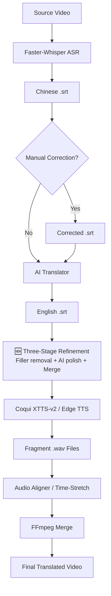

# Instructional Video Auto-Translation System 🎥→🌍

[Traditional Chinese Version (繁體中文版)](README.md) | [Quick Start Guide](QUICKSTART_EN.md)

A fully automated video translation system specifically designed for physiology instructional videos, converting Chinese teaching videos into high-quality English versions.

> [!CAUTION]
> **Medical Disclaimer**: The translated content and terminology generated by this system are intended for academic exchange and educational reference ONLY. AI translations may contain errors. For clinical medical use or formal educational diagnosis, please ensure a final review by licensed medical professionals. The developers are not responsible for any consequences resulting from translation errors.

## 🌟 Core Features

1.  **Automatic Speech Recognition (ASR)** - Uses Faster-Whisper to extract Chinese subtitles.
2.  **Intelligent Translation** - Defaults to Google Translate (Free) with **Physiology & Medical Terminology Optimization**.
3.  **🆕 Three-Stage English Subtitle Refinement** - Post-translation automatic filler removal, AI polishing of residual Chinese, and short-segment merging (`--refine`).
4.  **Voice Generation & Cloning** - Supports Edge TTS (Default) and **Coqui XTTS-v2** Voice Cloning (preserves the original speaker's characteristics).
5.  **Precise Alignment & Synthesis** - Uses `align_audio.py` + `FFmpeg` lossless time-stretching to eliminate audio-video desync.
6.  **GPU Acceleration** - Deep integration with **NVIDIA RTX 4090 (CUDA 12.1)** for 5x speed increase.
7.  **Modular Script Pipeline** - Individual scripts for each stage: translation, reference audio extraction, subtitle refinement, TTS, and audio alignment.

## 🎓 Tailored for Physiology & Medicine

-   **100+ Professional Glossary**: Covers Nervous, Endocrine, Respiratory, Circulatory, Digestive, and Reproductive systems.
-   **Smart Terminology Check**: Ensures terms like `action potential`, `synapse`, `peristalsis` are translated precisely.
-   **Academic Tone Adjustment**: Suitable for university-level medical education.
-   See [MEDICAL_TERMS_EN.md](MEDICAL_TERMS_EN.md) for the full terminology list.

**System Architecture:**


## 💰 Cost

-   **Completely Free**: Default configuration (Google Translate + Medical Terminology Optimization).
-   **Paid Options**: OpenAI/Claude for higher-quality medical translation.

## 🚀 Quick Start

**System Requirements:**
- Python 3.11+ | NVIDIA GPU (RTX 30/40 series) + CUDA 12.1+ | 16GB+ RAM

```powershell
# 1. Install dependencies
uv sync

# 2. Standard processing (Edge TTS, no GPU required for TTS)
uv run python main.py --video "video/example.mp4"

# 3. Full premium pipeline: XTTS Voice Cloning + Subtitle Refinement
uv run python scripts/extract_ref_audio.py --video "video/example.mp4" --start 30 --duration 15
uv run python main.py --video "video/example.mp4" `
    --xtts --ref-audio "output/ref_audio/example_ref.wav" `
    --refine

# 4. Batch process all videos
uv run python main.py --batch --refine
```

See [UV_GUIDE_EN.md](UV_GUIDE_EN.md) for full instructions.

## 📁 Project Structure

```
Physiology_Translator/
├── video/                    # Original video folder
├── output/                   # Output folder
│   ├── subtitles/           # Generated subtitle files
│   ├── audio/               # Generated audio segments
│   └── final_videos/        # Final processed videos
├── modules/                  # Core modules
│   ├── asr.py              # Speech-to-Text
│   ├── subtitle_cleaner.py # Chinese subtitle cleanup
│   ├── translator.py       # Translation
│   ├── tts.py              # Speech synthesis
│   └── video_assembler.py  # Video/Audio synthesis
├── scripts/                  # Modular tool scripts
│   ├── translate_subs.py   # Standalone subtitle translation
│   ├── extract_ref_audio.py# Reference audio extraction (for XTTS)
│   ├── generate_tts.py     # TTS audio generation
│   ├── align_audio.py      # Audio alignment & synthesis
│   └── refine_en_srt.py   # 🆕 Three-stage EN subtitle refinement
├── config.py                # Configuration file
└── main.py                  # Main program
```

## 📊 Processing Workflow

```
Source Video (video/*.mp4)
    ↓
[Step 1] ASR - Extract Chinese subtitles
    ↓
[Optional] Rule cleanup / Gemini proofreading
    ↓
[Step 2] Translate - Generate English subtitles
    ↓
[Step 2.5] 🆕 Three-Stage Refinement (--refine)
  ├─ Rule cleaning: Remove Then/Just/So sentence starters
  ├─ AI polishing: Translate residual Chinese, fix phrasing
  └─ Merge shorts: ~4,676 segments → ~1,295 (3.6x compression)
    ↓
[Step 3] TTS - Edge TTS or XTTS Voice Cloning
    ↓
[Step 4] Precise audio alignment & video synthesis
    ↓
output/final_videos/*_EN.mp4 (Final Output)
```

## 🔧 Key CLI Flags

| Flag | Description |
|------|-------------|
| `--video` | Specify a single video to process |
| `--batch` | Batch process all videos in `video/` folder |
| `--xtts` | Enable XTTS-v2 voice cloning |
| `--ref-audio` | Path to reference audio for voice cloning |
| `--refine` | Enable three-stage English subtitle refinement |
| `--subtitle-only` | Only extract Chinese subtitles (skip TTS & video) |
| `--gemini` | Enable Gemini AI proofreading for Chinese subtitles |

## 🐛 FAQ

### Q: "CUDA out of memory" error
**A:** Use a smaller Whisper model or switch to CPU mode in `config.py`.

### Q: Voice Cloning (XTTS) not working
**A:** Ensure you've run `uv pip install "TTS>=0.22.0"`. The first run downloads an ~1.8GB model.

### Q: Subtitles have too many filler words or fragmented short lines
**A:** Add `--refine` to your `main.py` command, or run `scripts/refine_en_srt.py` directly.

---
**Updated**: February 22, 2026
